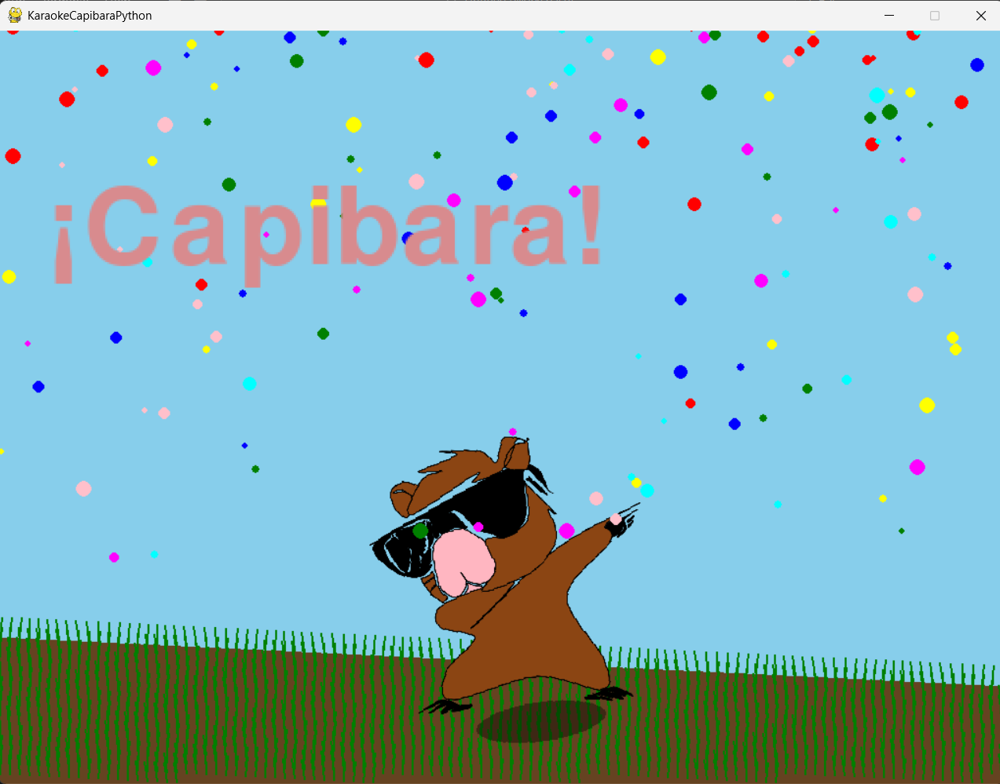
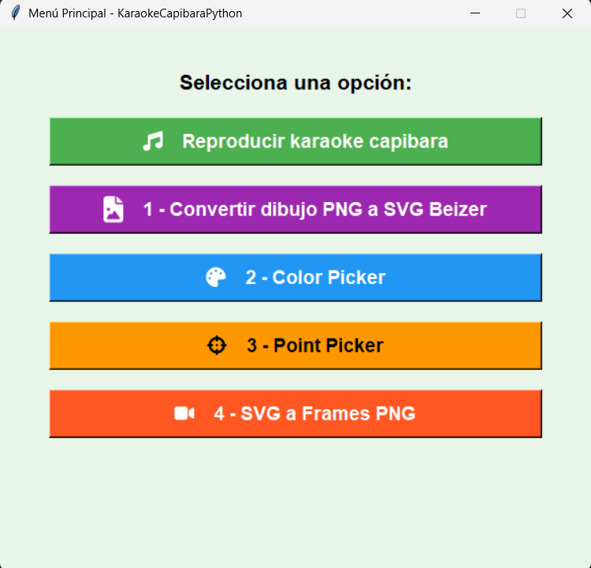
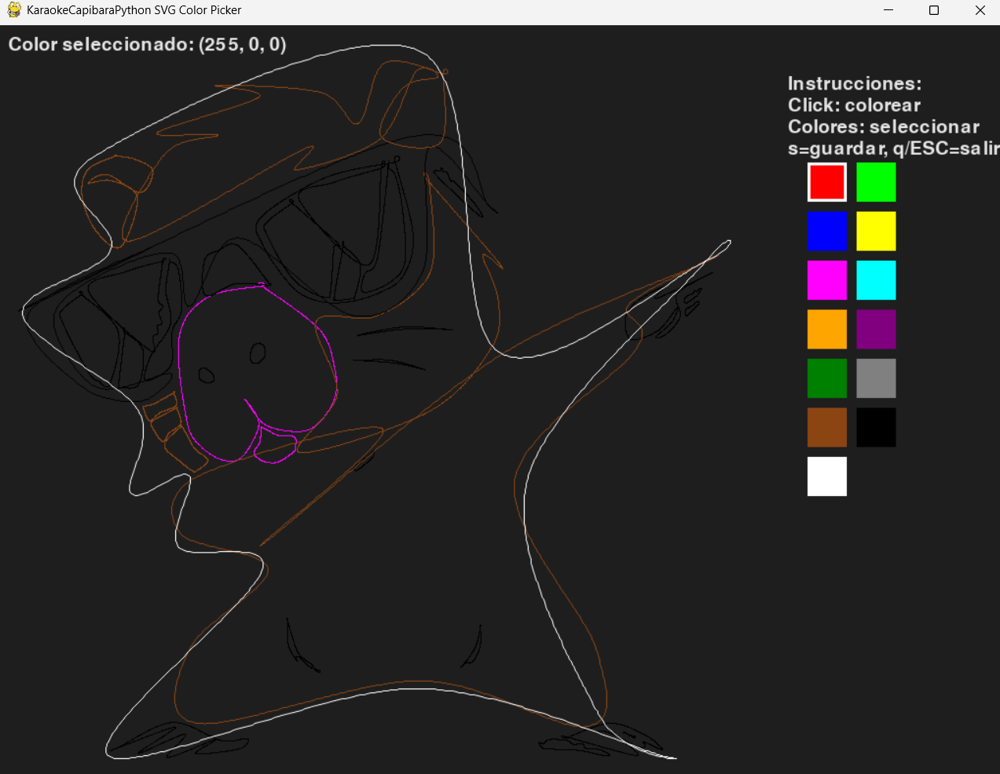
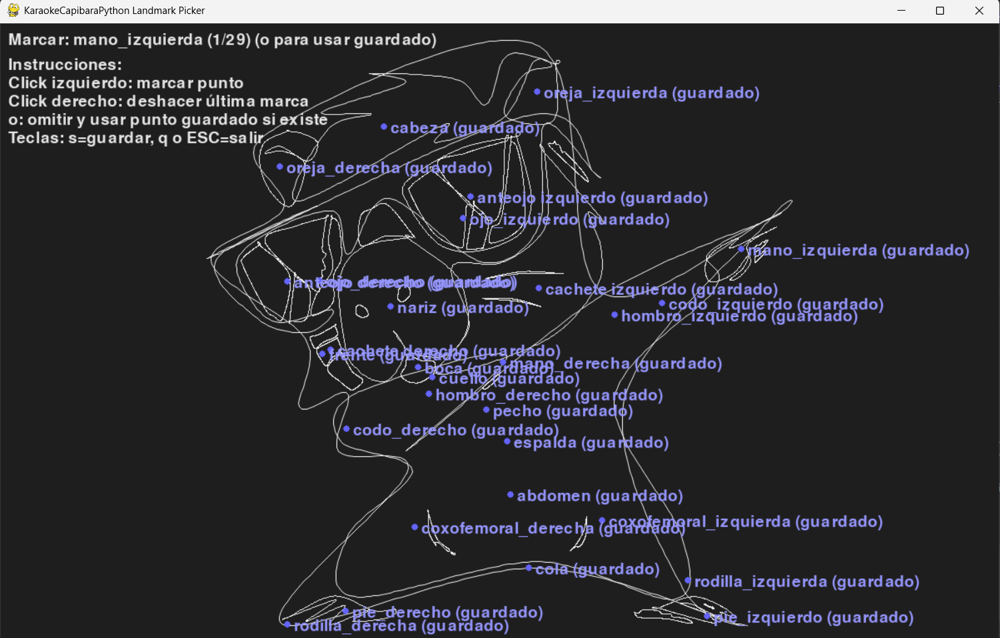

# KaraokeCapibaraPython

## Descripción

Repositorio para convertir PNGs a trazos vectoriales, generar/editar SVGs y producir animaciones y recursos multimedia. Incluye herramientas GUI, utilidades de conversión, y código para reproducir/organizar audio y letra para animaciones.

Este proyecto demuestra técnicas avanzadas en procesamiento de imágenes, gráficos vectoriales y desarrollo de aplicaciones multimedia en Python, integrando bibliotecas científicas y de renderizado para crear pipelines de conversión y animación.

## Capturas de Pantalla

### Animación Capibara


### Menú Principal


### Color Picker


### Point Picker



## Tecnologías y Dependencias

- **Lenguaje**: Python 3.8+
- **Bibliotecas principales**:
  - `pygame`: Renderizado en tiempo real, gestión de audio y eventos.
  - `numpy`: Cálculos matemáticos y manipulación de arrays.
  - `Pillow`: Procesamiento básico de imágenes.
  - `opencv-python`: Extracción de contornos y vectorización de imágenes raster.
  - `svgpathtools`: Manipulación y conversión de paths SVG, incluyendo curvas Bézier.
  - `manim`: Generación de animaciones matemáticas y extracción de frames.
  - `tkinter`: Interfaces gráficas nativas (incluido en Python estándar).
  - `tkfontawesome`: Iconos para interfaces tkinter.
- **Herramientas externas**:
  - `ffmpeg`: Extracción de frames de video.

## Instalación

1. Clona o descarga el repositorio.
2. Crea un entorno virtual (recomendado):
   ```powershell
   python -m venv .venv
   .\.venv\Scripts\Activate.ps1
   ```
3. Instala dependencias:
   ```powershell
   pip install -r requirements.txt
   ```
4. Asegúrate de tener recursos como `res/txt/letra.txt` y `res/wav/capibara.wav` (opcional). Para desarrollo, instala `manim` y `ffmpeg` si deseas regenerar animaciones.

## Uso

Ejecuta desde la raíz del repositorio:

```powershell
python main.py
```

Esto abre un menú principal con interfaz tkinter que permite acceder a las siguientes funcionalidades:

- **Reproducir karaoke capibara**: Inicia la aplicación principal de animación y sincronización de audio/letra.
- **Color Picker**: Herramienta interactiva para asignar colores a paths SVG.
- **Point Picker**: Herramienta para marcar landmarks (puntos de referencia) en SVGs.
- **Convertir dibujo PNG a SVG Bezier**: Interfaz gráfica para convertir imágenes PNG a SVGs con curvas Bézier.

## Estructura del Proyecto

- `main.py`: Menú principal con interfaz gráfica (tkinter) para acceder a las herramientas.
- `png_to_bezier_gui.py`: GUI para conversión automática PNG → SVG lineal → SVG Bézier.
- `recreate_pngs.py`: Script para regenerar animaciones: ejecuta Manim y extrae frames con ffmpeg.
- `requirements.txt`: Lista de dependencias Python.
- `res/`: Recursos estáticos (SVGs, textos, colores, audio).
- `media/`: Medios generados (imágenes, videos).
- `src/`: Código fuente principal:
  - `audio.py`: Gestión de audio con `pygame.mixer`.
  - `capibara_model.py`: Carga y renderizado de frames PNG, cálculo de centros con `svgpathtools`.
  - `game.py`: Bucle principal, eventos y composición de escena.
  - `lyrics.py`: Procesamiento y sincronización de letras.
- `utils/`: Utilidades técnicas:
  - `color_picker.py`: Asignación interactiva de colores a paths SVG.
  - `point_picker.py`: Marcado de landmarks en SVGs.
  - `convertir_png_a_svg_lineal.py`: Vectorización de imágenes raster a SVG lineal con OpenCV.
  - `convert_svg_to_bezier.py`: Conversión de paths SVG a curvas Bézier cúbicas.
  - `animar_svg_manim.py`: Escena Manim para animación basada en SVGs coloreados.

## Herramientas y Utilidades

### Pipeline de Conversión PNG → SVG

1. **Vectorización raster a SVG lineal** (`convertir_png_a_svg_lineal.py`):
   - Usa OpenCV para extraer contornos de imágenes PNG.
   - Genera paths SVG con líneas poligonales.

2. **Conversión a curvas Bézier** (`convert_svg_to_bezier.py`):
   - Emplea `svgpathtools` para convertir líneas a curvas cúbicas Bézier usando aproximación Catmull-Rom.

3. **Interfaz gráfica unificada** (`png_to_bezier_gui.py`):
   - Automatiza los pasos anteriores en una GUI tkinter.

### Edición Interactiva de SVGs

- **Color Picker** (`color_picker.py`):
  - Renderiza SVG en Pygame, permite selección de colores y asignación a paths cerrados.
  - Guarda mapeo en JSON para uso en animaciones.

- **Point Picker** (`point_picker.py`):
  - Interfaz para marcar puntos de referencia (landmarks) en SVGs.
  - Facilita el mapeo de partes anatómicas para animaciones precisas.

### Generación de Animaciones

- **Manim Scene** (`animar_svg_manim.py`):
  - Carga SVGs coloreados, aplica landmarks para deformaciones.
  - Produce video MOV y extrae frames PNG.

- **Regeneración completa** (`recreate_pngs.py`):
  - Ejecuta Manim y ffmpeg para actualizar recursos de animación.

## Notas Técnicas

- **Procesamiento de Imágenes**: Integración de OpenCV para análisis morfológico y extracción de características.
- **Gráficos Vectoriales**: Uso de `svgpathtools` para geometría computacional y curvas paramétricas.
- **Animación Matemática**: Manim para visualización de transformaciones basadas en landmarks.
- **Interfaz y Usabilidad**: Tkinter para GUIs accesibles, Pygame para renderizado interactivo.
- **Audio y Sincronización**: `pygame.mixer` para playback, con timestamps para alineación de letra.
- **Compatibilidad**: Configurado para Windows (e.g., `SDL_VIDEODRIVER=windib` en Pygame).
- **Arquitectura**: Modular, con separación de utilidades, lógica de aplicación y recursos.

Este repositorio sirve como ejemplo práctico para el aprendizaje de integración de bibliotecas Python en pipelines de multimedia y gráficos.


## Autor

Andrey Rodríguez Araya

---