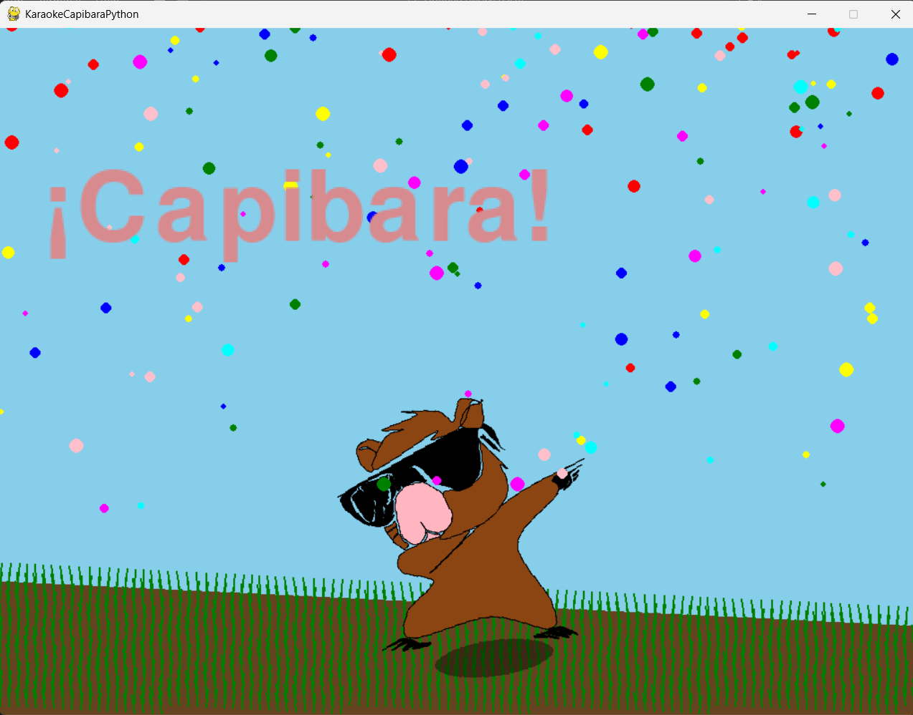
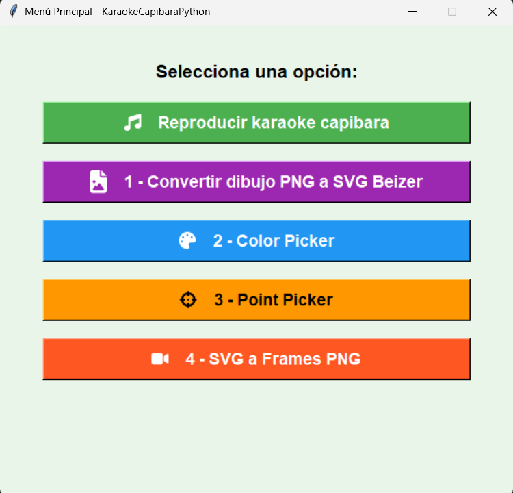
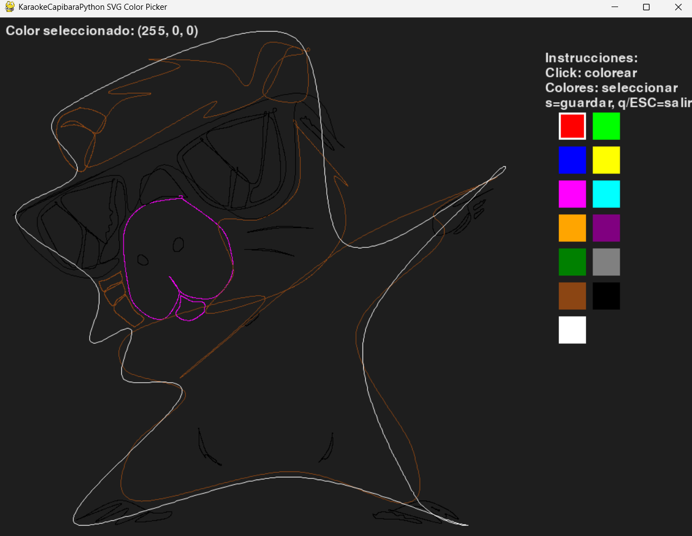
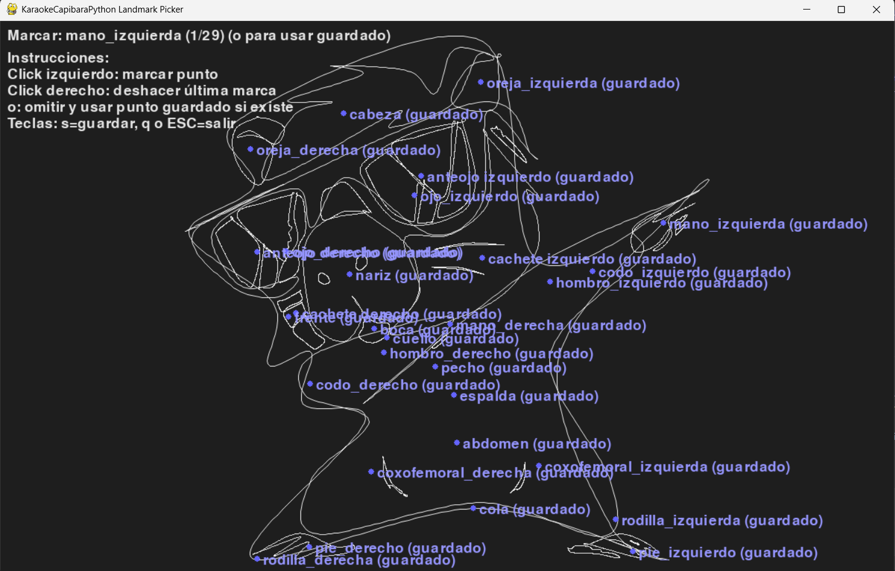

# KaraokeCapibaraPython

For the Spanish version, see [README.es.md](README.es.md).

## Description

Repository for converting PNGs to vector strokes, generating/editing SVGs, and producing animations and multimedia resources. Includes GUI tools, conversion utilities, and code for playing/organizing audio and lyrics for animations.

This project demonstrates advanced techniques in image processing, vector graphics, and multimedia application development in Python, integrating scientific and rendering libraries to create conversion and animation pipelines.

## Screenshots

### Capibara Animation


### Main Menu


### Color Picker


### Point Picker


## Technologies and Dependencies

- **Language**: Python 3.8+
- **Main Libraries**:
  - `pygame`: Real-time rendering, audio management, and events.
  - `numpy`: Mathematical calculations and array manipulation.
  - `Pillow`: Basic image processing.
  - `opencv-python`: Contour extraction and raster image vectorization.
  - `svgpathtools`: Manipulation and conversion of SVG paths, including Bézier curves.
  - `manim`: Generation of mathematical animations and frame extraction.
  - `tkinter`: Native graphical interfaces (included in Python standard).
  - `tkfontawesome`: Icons for tkinter interfaces.
- **External Tools**:
  - `ffmpeg`: Video frame extraction.

## Installation

1. Clone or download the repository.
2. Create a virtual environment (recommended):
   ```powershell
   python -m venv .venv
   .\.venv\Scripts\Activate.ps1
   ```
3. Install dependencies:
   ```powershell
   pip install -r requirements.txt
   ```
4. Ensure you have resources like `res/txt/letra.txt` and `res/wav/capibara.wav` (optional). For development, install `manim` and `ffmpeg` if you want to regenerate animations.

## Usage

Run from the repository root:

```powershell
python main.py
```

This opens a main menu with a tkinter interface that allows access to the following functionalities:

- **Play capibara karaoke**: Starts the main animation and audio/lyrics synchronization application.
- **Color Picker**: Interactive tool for assigning colors to SVG paths.
- **Point Picker**: Tool for marking landmarks (reference points) in SVGs.
- **Convert PNG drawing to SVG Bézier**: Graphical interface for converting PNG images to SVGs with Bézier curves.

## Project Structure

- `main.py`: Main menu with graphical interface (tkinter) to access tools.
- `png_to_bezier_gui.py`: GUI for automatic PNG → SVG linear → SVG Bézier conversion.
- `recreate_pngs.py`: Script to regenerate animations: runs Manim and extracts frames with ffmpeg.
- `requirements.txt`: List of Python dependencies.
- `res/`: Static resources (SVGs, texts, colors, audio).
- `media/`: Generated media (images, videos).
- `src/`: Main source code:
  - `audio.py`: Audio management with `pygame.mixer`.
  - `capibara_model.py`: Loading and rendering of PNG frames, center calculation with `svgpathtools`.
  - `game.py`: Main loop, events, and scene composition.
  - `lyrics.py`: Processing and synchronization of lyrics.
- `utils/`: Technical utilities:
  - `color_picker.py`: Interactive color assignment to SVG paths.
  - `point_picker.py`: Landmark marking in SVGs.
  - `convertir_png_a_svg_lineal.py`: Raster image vectorization to linear SVG with OpenCV.
  - `convert_svg_to_bezier.py`: Conversion of SVG paths to cubic Bézier curves.
  - `animar_svg_manim.py`: Manim scene for animation based on colored SVGs.

## Tools and Utilities

### PNG → SVG Conversion Pipeline

1. **Raster to linear SVG vectorization** (`convertir_png_a_svg_lineal.py`):
   - Uses OpenCV to extract contours from PNG images.
   - Generates SVG paths with polygonal lines.

2. **Conversion to Bézier curves** (`convert_svg_to_bezier.py`):
   - Uses `svgpathtools` to convert lines to cubic Bézier curves using Catmull-Rom approximation.

3. **Unified graphical interface** (`png_to_bezier_gui.py`):
   - Automates the previous steps in a tkinter GUI.

### Interactive SVG Editing

- **Color Picker** (`color_picker.py`):
  - Renders SVG in Pygame, allows color selection and assignment to closed paths.
  - Saves mapping in JSON for use in animations.

- **Point Picker** (`point_picker.py`):
  - Interface for marking reference points (landmarks) in SVGs.
  - Facilitates mapping of anatomical parts for precise animations.

### Animation Generation

- **Manim Scene** (`animar_svg_manim.py`):
  - Loads colored SVGs, applies landmarks for deformations.
  - Produces MOV video and extracts PNG frames.

- **Complete regeneration** (`recreate_pngs.py`):
  - Runs Manim and ffmpeg to update animation resources.

## Technical Notes

- **Image Processing**: Integration of OpenCV for morphological analysis and feature extraction.
- **Vector Graphics**: Use of `svgpathtools` for computational geometry and parametric curves.
- **Mathematical Animation**: Manim for visualization of landmark-based transformations.
- **Interface and Usability**: Tkinter for accessible GUIs, Pygame for interactive rendering.
- **Audio and Synchronization**: `pygame.mixer` for playback, with timestamps for lyrics alignment.
- **Compatibility**: Configured for Windows (e.g., `SDL_VIDEODRIVER=windib` in Pygame).
- **Architecture**: Modular, with separation of utilities, application logic, and resources.

This repository serves as a practical example for learning the integration of Python libraries in multimedia and graphics pipelines.

## Disclaimer

The rights to the song and lyrics belong to the Canta y Baila page. Reference: [YouTube Link](https://www.youtube.com/watch?v=KTAfB0-IKvU&list=RDKTAfB0-IKvU&start_radio=1)

## Author

Andrey Rodríguez Araya